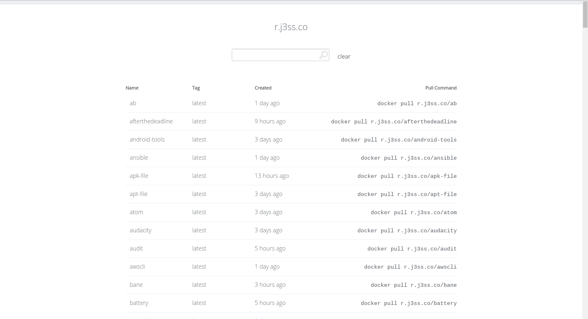
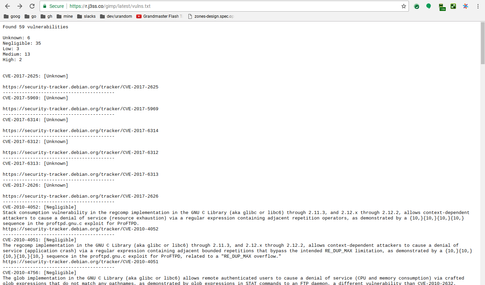

# reg-server

A static UI for a docker registry. Comes with vulnerability scanning if you
have a [CoreOS Clair](https://github.com/coreos/clair) server set up.

Demo at [r.j3ss.co](https://r.j3ss.co).

## Usage

```console
$ reg-server -h
reg-server -  Docker registry v2 static UI server.

Usage: reg-server <command>

Flags:

  -cert           path to ssl cert (default: <none>)
  -clair          url to clair instance (default: <none>)
  -d              enable debug logging (default: false)
  -f              force allow use of non-ssl (default: false)
  -force-non-ssl  force allow use of non-ssl (default: false)
  -insecure       do not verify tls certificates (default: false)
  -interval       interval to generate new index.html's at (default: 1h0m0s)
  -k              do not verify tls certificates (default: false)
  -key            path to ssl key (default: <none>)
  -once           generate an output once and then exit (default: false)
  -p              password for the registry (default: <none>)
  -password       password for the registry (default: <none>)
  -port           port for server to run on (default: 8080)
  -r              URL to the private registry (ex. r.j3ss.co) (default: <none>)
  -registry       URL to the private registry (ex. r.j3ss.co) (default: <none>)
  -skip-ping      skip pinging the registry while establishing connection (default: false)
  -timeout        timeout for HTTP requests (default: 1m0s)
  -u              username for the registry (default: <none>)
  -username       username for the registry (default: <none>)

Commands:

  version  Show the version information.
```

## Screenshots




